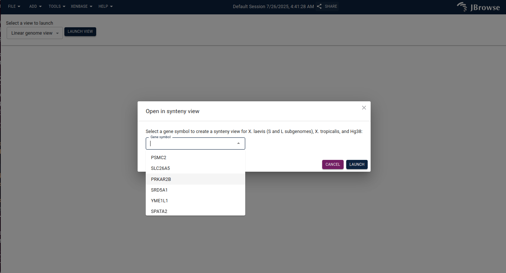
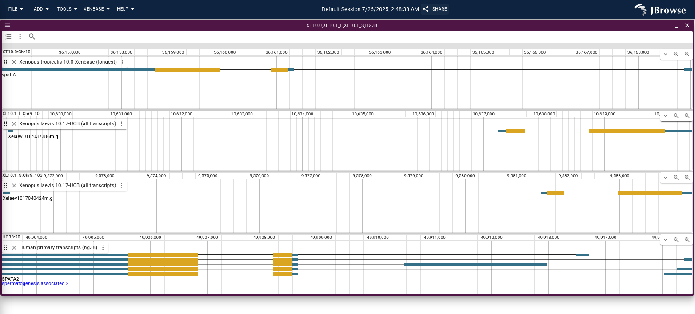

# jbrowse-plugin-xenbase

A plugin for the xenbase crew

Sets up a ortholog in multi-way synteny view

A general solution to this SHOULD get built into jbrowse, now that it is
demonstrated here, maybe we can make some progress

Note: whole genome alignments or synteny tracks could also be loaded between
each "row", I just didn't have that set up

## Screenshots

 Figure 1. Screenshot showing user selection of ortholog name

 Figure 2. The result after hitting Launch

## Notes on setup

I cloned various xenbase resources locally to make this, deploying on your
server probably requires adding refNameAliases for hg38

Hope this helps!
