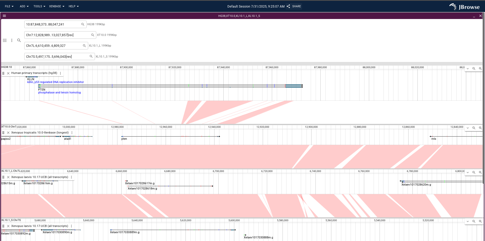

# jbrowse-plugin-xenbase

A plugin for the xenbase crew

Sets up a multi-way synteny view to view orthologous genes across different genomes

A general solution to this SHOULD get built into jbrowse, now that it is
demonstrated here, maybe we can make some progress

Note: whole genome alignments or synteny tracks could also be loaded between
each "row", I just didn't have that set up

## Screenshots

 Figure 1. Screenshot showing user selection of ortholog name

 Figure 2. The result after hitting Launch

## Notes on setup

I cloned various xenbase resources locally to make this, deploying on your
server probably requires adding refNameAliases for hg38

I had to do some hacky stuff to clone xenbase resources locally and partially
since xenbase doens't have CORS enabled, so more integrations like synteny
tracks are not here

Hope this helps!
